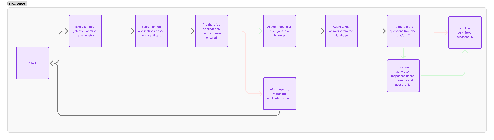

# InstantApply

A platform to streamline job applications.
### Demo: https://drive.google.com/drive/folders/1MXEEPN3f61T9VI8zWsxLmzQC34YKX91r?usp=sharing
## Hosted: https://instantapply.onrender.com/

## Development Setup

### Prerequisites

- Python 3.8+
- pip
- virtualenv (recommended)
- poppler (install via homebrew for Mac)

### Installation

1. Clone the repository
   ```
   git clone <repository-url>
   cd InstantApply
   ```

2. Run the setup script to install dependencies and set up the development environment
   ```
   chmod +x setup_dev.sh
   ./setup_dev.sh
   ```
   
   This script will:
   - Install the necessary system dependencies for your OS
   - Create and activate a virtual environment
   - Install Python dependencies
   - Initialize the database

3. Alternatively, you can manually set up the environment:
   ```
   # Create and activate virtual environment
   python3.11 -m venv venv
   source venv/bin/activate  # On Windows, use: venv\Scripts\activate
   
   # Install dependencies
   pip install -r requirements.txt
   
   # Initialize database
   python init_db.py
   ```

### For Python 3.12 Users

If you're using Python 3.12, there are known compatibility issues with some packages, especially greenlet. To install properly:

1. Make the installation script executable:
   ```bash
   chmod +x install_dependencies.sh
   ```

2. Run the installation script:
   ```bash
   ./install_dependencies.sh
   ```

### Manual Installation

If the script doesn't work for you:

1. Install greenlet first with special flags:
   ```bash
   pip install --no-build-isolation greenlet==3.0.1
   ```

2. Then install the rest of the requirements:
   ```bash
   pip install -r requirements.txt
   ```

### Troubleshooting

If you still encounter issues:

- Try installing from source: `pip install greenlet==3.0.1 --no-binary :all:`
- Try a different greenlet version: `pip install greenlet==2.0.2`
- Install SQLAlchemy separately: `pip install SQLAlchemy==2.0.21 --no-deps`

### Running the Application

1. Activate the virtual environment if not already active:
   ```
   source venv/bin/activate  # On Windows, use: venv\Scripts\activate
   ```

2. Start the Flask development server:
   ```
   flask run
   ```

3. Access the application at http://127.0.0.1:5000

### Database Migrations

To create a new migration after model changes:
```
flask db migrate -m "Description of changes"
```

To apply migrations:
```
flask db upgrade
```

To roll back a migration:
```
flask db downgrade
```

## Features

- Search for jobs on Indeed based on job title and location
- Extract application questions from job postings
- Generate intelligent responses to application questions using Google Gemini 2.0
- Automatically fill and submit applications
- Track application status
- Parse and extract text from resume documents (PDF, DOCX, TXT)

### Getting a Gemini API Key

1. Go to [Google AI Studio](https://makersuite.google.com/app/apikey)
2. Create a new API key
3. Add it to your .env file: `GEMINI_API_KEY=your_key_here`

## Troubleshooting

If you encounter database errors like "no such table: users", make sure you've initialized the database:

```
python init_db.py
```

If problems persist, try removing the database file and creating it again:

```
rm instance/instant_apply.db  # On Windows: del instance\instant_apply.db
python init_db.py
```

## Project Structure

- app.py - Main Flask application file
- config.py - Configuration settings
- .env - Environment variables (API keys, secrets)
- init_db.py - Database initialization script
- utils - Utility modules
  - `indeed_scraper.py` - Indeed job search functionality
  - `application_filler.py` - AI-powered form filling using Gemini
  - `job_submitter.py` - Job submission handling
- models - Database models
  - `user.py` - User model definitions
  - `application.py` - Application tracking model
- templates - HTML templates
- static - Static assets (CSS, JS)

## Technical Architecture



The architecture diagram above illustrates how the components of InstantApply interact:

1. **Frontend Layer**: User interface built with Flask templates, JavaScript, and CSS
2. **Application Layer**: Core application logic including Flask routes and controllers
3. **AI Integration Layer**: Connection to Google Gemini API for intelligent question answering
4. **Data Access Layer**: Database interactions via SQLAlchemy models
5. **External Services**: Integration with job boards and browser automation via Playwright

The system follows a modular design where components communicate through well-defined interfaces, making it easier to extend functionality or replace individual components.

## How It Works

1. Users create a profile with their personal information, resume, skills, and experience
2. Users search for jobs by title and location
3. The system searches Indeed for matching job listings
4. Users select jobs to apply for
5. The AI automatically:
   - Extracts application questions
   - Generates appropriate responses using Gemini 2.0
   - Fills out the application form
   - Submits the application

## Additional Features

### Resume Parsing

InstantApply can extract text from the following file formats:
- PDF documents
- Microsoft Word documents (DOCX)
- Plain text files (TXT)

The extracted text is used to:
1. Help the AI better understand your qualifications
2. Automatically fill out job applications
3. Store a searchable version of your resume

## License

MIT License